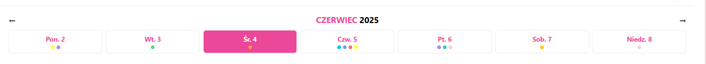

# .Organizee

---

Aplikacja do planowania tygodnia, stworzona z wykorzystaniem **Next.js**, **TypeScript**, **Prisma** oraz **PostgreSQL**.  
Stylowana przy użyciu **Tailwind CSS** i wdrożona w chmurze dzięki platformie **Render**.

Aplikacja dostępna pod adresem:

> 🔗 https://weekly-planner-to-do.onrender.com/

---

### 🏠 Ekran główny
Widok kalendarza tygodniowego z oznaczeniami kolorystycznymi:  

### 🗓️ Widok z aktywnościami w ciągu dnia
Zadania wyświetlane na osi czasu dla konkretnego dnia:  

### ➕ Dodawanie nowego zadania
Formularz tworzenia nowego zadania:  

### ⏱️ Własny czas trwania zadania – wybór
Opcja niestandardowego ustawienia czasu trwania zadania:  

### ⏱️ Własny czas trwania zadania – ustawienie 6h 15min
Dostosowanie długości zadania z dokładnością do 15 minut:  

### 🖊️ Edycja istniejącego zadania
Szybka możliwość edytowania szczegółów zadania:  

### 📝 Formularz edycji zadania
Pełny formularz edycji:  

### ✅ Zakończone zadanie
Zadania można oznaczyć jako ukończone za pomocą checkboxa:  

### 📅 Widok całego tygodnia z zadaniami
Podsumowanie całego tygodnia z kolorowymi wskaźnikami:  

---