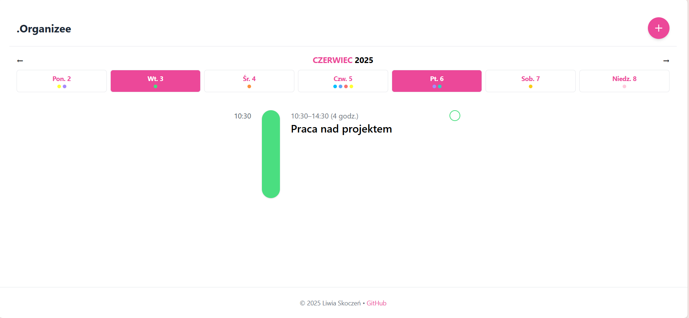
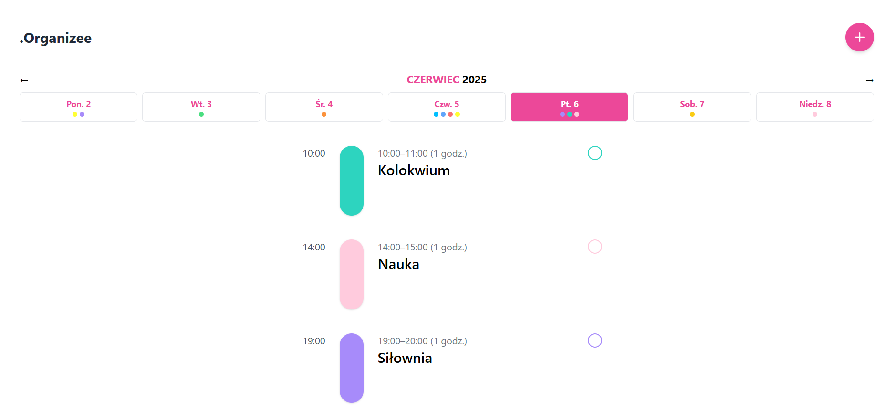
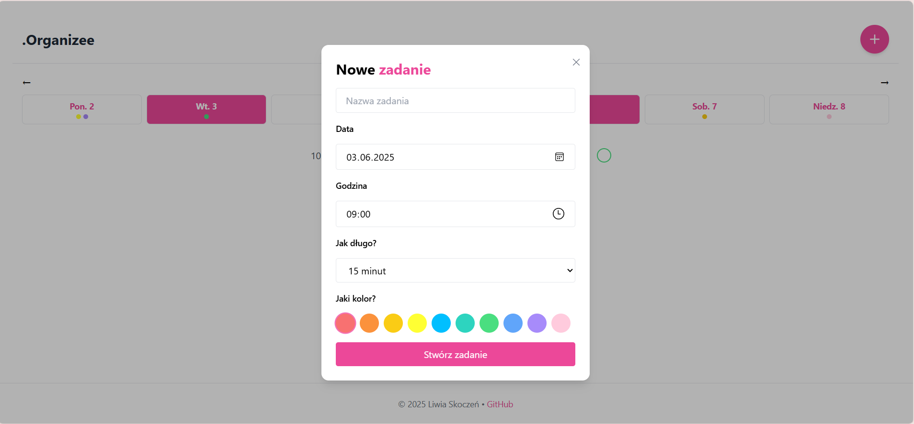
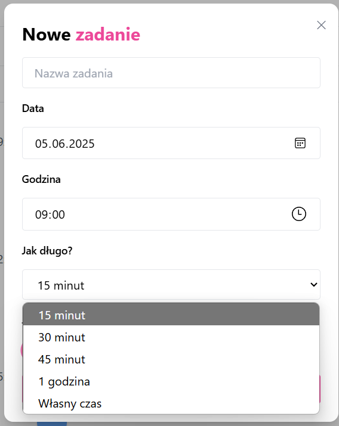
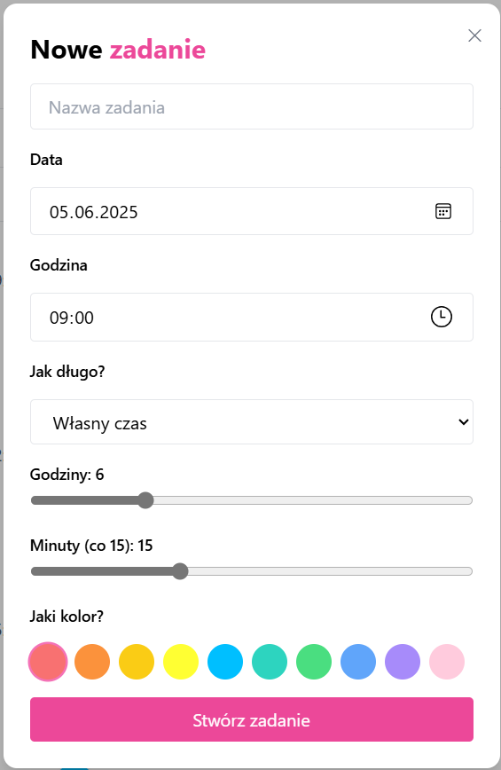
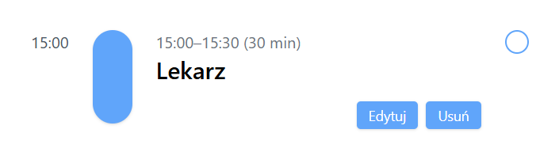
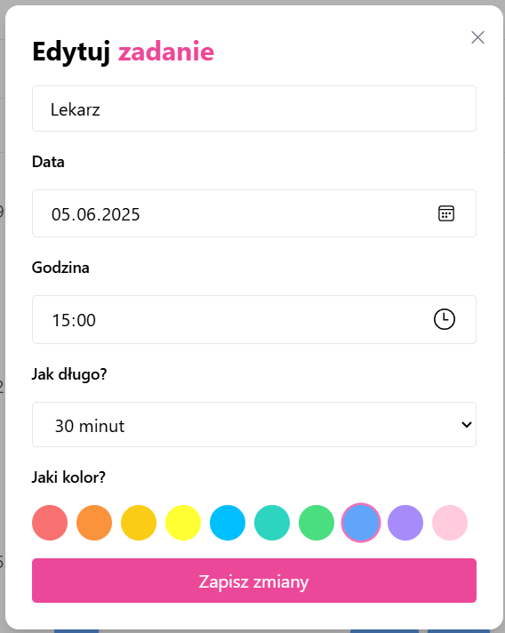
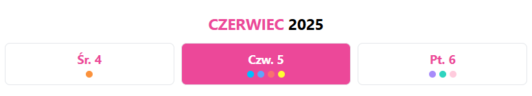

# .Organizee

---

Aplikacja do planowania tygodnia, stworzona z wykorzystaniem **Next.js**, **TypeScript**, **Prisma** oraz **PostgreSQL**.  
Stylowana przy użyciu **Tailwind CSS** i wdrożona w chmurze dzięki platformie **Render**.

Aplikacja dostępna pod adresem:

> 🔗 https://weekly-planner-to-do.onrender.com/

---

### Ekran główny

### Zadania wyświetlane na osi czasu dla konkretnego dnia:  

### Formularz tworzenia nowego zadania:  

### Opcja niestandardowego ustawienia czasu trwania zadania:  

### Własny czas trwania zadania. Przykład: ustawienie 6h 15min

### Edycja istniejącego zadania

### Formularz edycji zadania

### Zadania można oznaczyć jako ukończone za pomocą checkboxa:  

### Widok całego tygodnia z zadaniami

W tym widoku każdy dzień tygodnia ma przypisane kolorowe kropki, które odpowiadają zadaniom zaplanowanym na ten dzień.  
🔸 **Kolor kropki odpowiada kolorowi zadania**, który wybierasz podczas jego tworzenia.  
🔸 **Liczba kropek = liczba zadań** zaplanowanych na dany dzień.

---